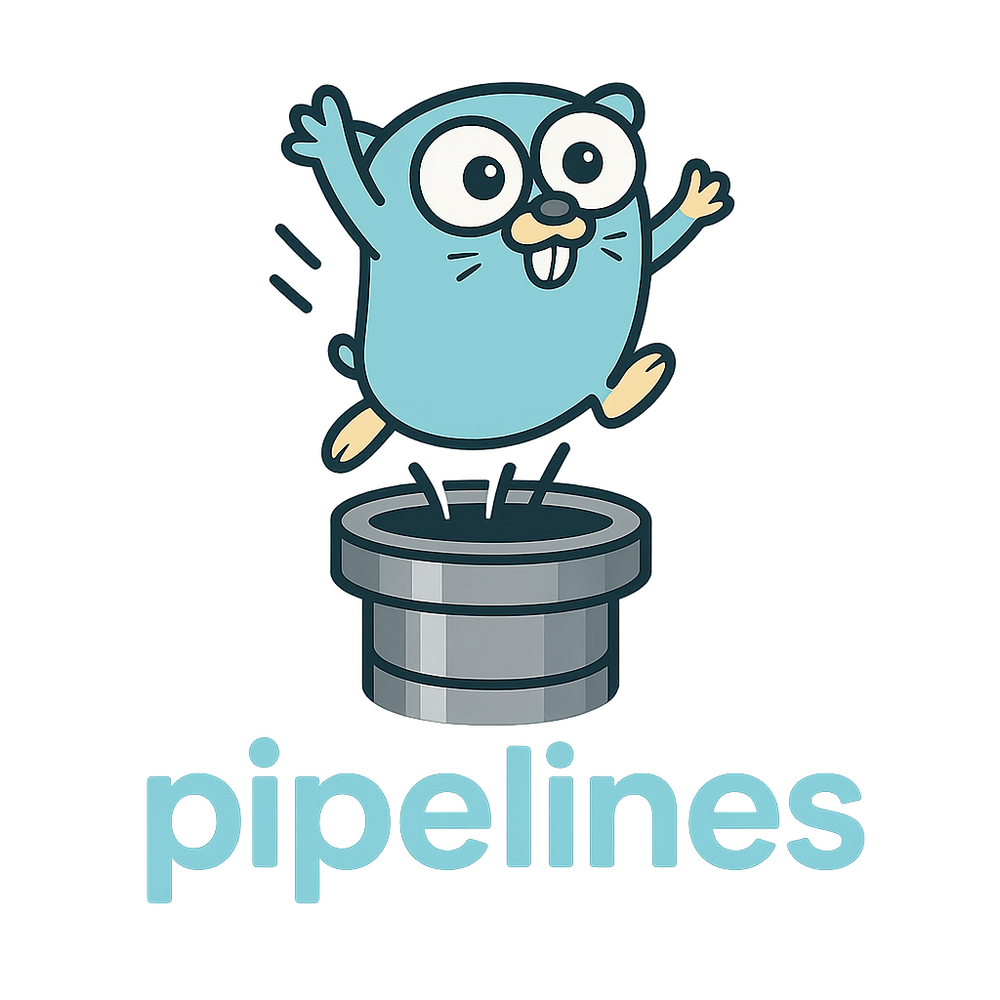

[](#)

[](https://github.com/elastiflow/pipelines/actions/workflows/go_checks.yml)
[](https://pkg.go.dev/github.com/elastiflow/pipelines)
[](https://goreportcard.com/report/github.com/elastiflow/pipelines)
[](https://sonarcloud.io/summary/new_code?id=elastiflow_pipelines)
---

The `pipelines` module is a Go library designed to facilitate the creation and management of:

1. Data processing pipelines
2. Reactive streaming applications leveraging Go's concurrency primitives

It provides a set of tools for **flow control**, **error handling**, and **pipeline processes**. 
Under the hood, it uses Go's channels and goroutines to enable concurrency at each stage of the pipeline.

## Setup

To get started with the `pipelines` module, follow these steps:

1. Install the `pipelines` module:

    ```sh
    go get github.com/elastiflow/pipelines
    ```

2. (Optional) To view local documentation via `godoc`:
    ```sh
    go install -v golang.org/x/tools/cmd/godoc@latest
    make docs
    ```
   
3. Once running, visit [GoDocs](http://localhost:6060/pkg/github.com/elastiflow/pipelines/) to view the 
latest documentation locally.

## Real World Applicability

### When to Use

- **ETL (Extract, Transform, Load)** style scenarios where data arrives in a stream, and you want to apply 
transformations or filtering in a concurrent manner.
- **Complex concurrency flows**: easily fan out, fan in, or broadcast data streams.
- **Reactive Streaming Applications**: serves as a light framework for Go native reactive streaming applications.

### Channel Management

- **Sources** (e.g. `FromArray`, `FromChannel`) produce data into a channel.
- **DataStream** transformations (e.g. `Run`, `Filter`, `Map`) read from inbound channels and write results to outbound channels.
- **Sinks** (e.g. `ToChannel`) consume data from the final output channels.
- Each method typically spins up **one or more goroutines** which connect these channels together, allowing parallel processing.

## High-Level Details

### Pipeline

A pipeline is a series of data processing stages connected by channels. Each stage (`datastreams.DataStream`) is a function that performs a specific task and passes its output to the next stage. The `pipelines` module provides a flexible way to define and manage these stages.

### DataStream

The `datastreams.DataStream` struct is the core of the `pipelines` module. It manages the flow of data through the pipeline stages and handles errors according to the provided parameters.

### Key Components

#### Functions

- **ProcessFunc**
A user-defined function type used in a given `DataStream` stage via the `DataStream.Run()` method.
For instance:
    ```go 
    ds = ds.Run(func(v int) (int, error) {
        if v < 0 {
            return 0, fmt.Errorf("negative number: %d", v)
        }
        return v + 1, nil
    })
    ```

- **TransformFunc**
A user-defined function type `func(T) (U, error)` used with the `Map()` method to convert from type `T` to a different type `U`.  
For instance:
    ```go
    ds = ds.Map(func(i int) (string, error) {
        return fmt.Sprintf("Number: %d", i), nil
    })
    ```
  
- **FilterFunc**
A user-defined function type func(T) (bool, error) used with the Filter() method to decide if an item should pass through (true) or be dropped (false).
For instance:
    ```go
    ds = ds.Filter(func(i int) (bool, error) {
        return i % 2 == 0, nil
    })
    ```

**KeyByFunc**: A user-defined function type used to partition the data stream into different segments based on a key. This is useful for grouping data before applying transformations or aggregations.
For instance:
```go
    kds := ds.KeyBy[testStruct, int](
        New[testStruct](ctx, input, errCh).WithWaitGroup(&sync.WaitGroup{}),
        func(i int) (int, error) {
            return i % 2, nil
        },
        Params{
            BufferSize: 50,
            Num:        1, // only 1 output channel per key
        },
    )
```

**WindowFunc**: A user-defined function to process batched data in a window. This is useful for aggregating data over time or count-based windows.
For instance:
```go
    kds = ds.Window[testStruct, string, *testInference](
        datastreams.KeyBy[*SensorReading, string](p, keyFunc),
        TumblingWindowFunc,
        partitionFactory,
        datastreams.Params{
            BufferSize: 50,
        },
    )
```

#### Sources
- **FromArray([]T)**: Convert a Go slice/array into a Sourcer
- **FromChannel(<-chan T)**: Convert an existing channel into a Sourcer
- **FromDataStream(DataStream[T])**: Convert an existing DataStream into a Sourcer

#### Sinks
- **ToChannel(chan<- T)**: Write DataStream output into a channel

#### Windows
Window performs time- or count-based aggregation on a partitioned stream.
- **NewTumblingFactory[T]**: Creates fixed-size windows that do not overlap.
- **NewSlidingFactory[T]**: Creates overlapping windows.
- **NewIntervalFactory[T]**: Creates windows based on a time interval.
  
#### Methods
- **Run(ProcessFunc[T]) DataStream[T]**: Process each item with a user function
- **Filter(FilterFunc[T]) DataStream[T]**: Filter items by user-defined condition
- **Map(TransformFunc[T,U]) DataStream[U]**: Transform each item from T to U
- **KeyBy(KeyByFunc[T]) DataStream[T]**: Partition the stream by a key
- **Window(WindowFunc[T]) DataStream[T]**: Apply a window function to the stream
- **Expand(ExpandFunc[T]) DataStream[T]**: Explode each item into multiple items
- **FanOut() DataStream[T]**: Create multiple parallel output channels
- **FanIn() DataStream[T]**: Merge multiple channels into one
- **Broadcast() DataStream[T]**: Duplicate each item to multiple outputs
- **Tee() (DataStream[T], DataStream[T])**: Split into two DataStreams
- **Take(Params{Num: N}) DataStream[T]**: Take only N items
- **OrDone() DataStream[T]**: Terminates if upstream is closed
- **Out() <-chan T**: Underlying output channel
- **Sink(Sinker[T]) DataStream[T]**: Push items to a sink

#### Method Params
- **Params**:
  Used to pass arguments into `DataStream` methods.
    - Options
        - **SkipError (bool)**: If true, any error in ProcessFunc / TransformFunc / FilterFunc causes that item to be skipped rather than stopping the pipeline.
        - **Num (int)**: Used by methods like FanOut, Broadcast, and Take to specify how many parallel channels or how many items to consume.
        - **BufferSize (int)**: Controls the size of the buffered channels created for that stage. Larger buffers can reduce blocking but use more memory.
        - **SegmentName (string)**: Tag a pipeline stage name, useful for logging or debugging errors (e.g. “segment: broadcast-2”).


### Examples

Below is an example of how to use the `pipelines` module to create simple pipelines.
Additional examples can be found in the godocs.

#### Squaring Numbers

This example demonstrates how to set up a pipeline that takes a stream of integers, squares each odd integer, and outputs the results.

```go
package main

import (
	"context"
	"fmt"
	"log/slog"

	"github.com/elastiflow/pipelines"
	"github.com/elastiflow/pipelines/datastreams"
	"github.com/elastiflow/pipelines/datastreams/sources"
)

func createIntArr(num int) []int {
	var arr []int
	for i := 0; i < num; i++ {
		arr = append(arr, i)
	}
	return arr
}

func squareOdds(v int) (int, error) {
	if v%2 == 0 {
		return v, fmt.Errorf("even number error: %v", v)
	}
	return v * v, nil
}

func exProcess(p datastreams.DataStream[int]) datastreams.DataStream[int] {
	return p.OrDone().FanOut(
		datastreams.Params{Num: 2},
	).Run(
		squareOdds,
	)
}

func main() {
	errChan := make(chan error, 10)
	defer close(errChan)

	pl := pipelines.New[int, int]( // Create a new Pipeline
		context.Background(),
		sources.FromArray(createIntArr(10)), // Create a source to start the pipeline
		errChan,
	).Start(exProcess)

	go func(errReceiver <-chan error) { // Handle Pipeline errors
		defer pl.Close()
		for err := range errReceiver {
			if err != nil {
				slog.Error("demo error: " + err.Error())
				// return if you wanted to close the pipeline during error handling.
			}
		}
	}(pl.Errors())
	for out := range pl.Out() { // Read Pipeline output
		slog.Info("received simple pipeline output", slog.Int("out", out))
	}
}
```

## Contributing
We welcome your contributions! Please see our [Contributing Guide](CONTRIBUTING.md) for details on how to open issues, submit pull requests, and propose new features.

## License
This project is licensed under the Apache 2.0 License - see the [LICENSE](LICENSE) file for details.
